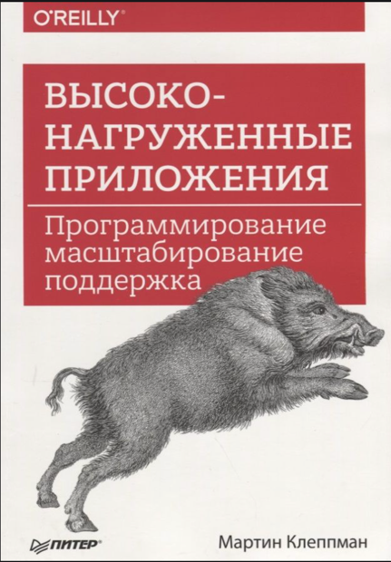
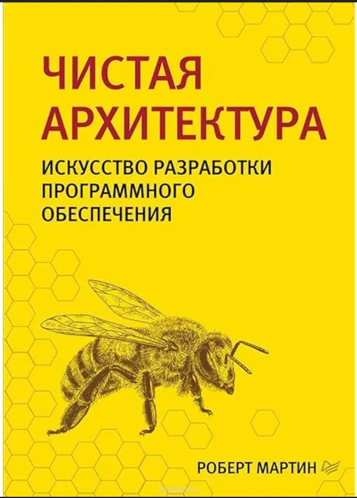
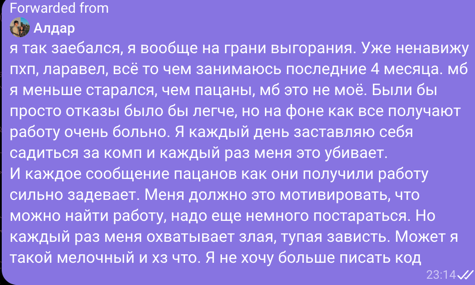
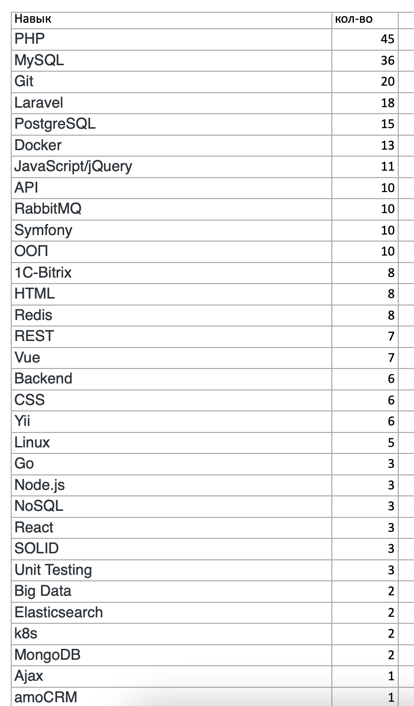

Привет! Меня зовут Михаил, и в свой 21 год я уже lead PHP-разработчик.

Всего за 13 месяцев я прошел путь от первого "Hello, World!" до оффера на 300к

Читал ли я "Операционные системы" Танненабума как рекомендуют некоторые известные специалисты в интернете? 

Нет. я даже не осилил кабанчика с пчелкой

https://habr.com/ru/articles/892804/

Вместо этого, каждый раз когда я ощущал, что задачи на работе перестают меня развивать, 
я находил на рынке действующего специалиста выше меня уровнем и платил ему деньги за обучение.

таким образом за 1й год я прошел обучение у 4х специалистов и потратил больше 400 тысяч на это.

это помогло мне увеличить доход в 10 раз за первый год - я вкатился на 30к, и через 13 месяцев получил оффер на 300к

Я мог бы расти своими силами до этого уровня, но это заняло бы несколько лет.
сейчас же одна моя зп отбивает все эти затраты и получается экономит эти самые пару лет жизни

Еще одна проблема - обучаться одному сложно, впервую очередь с моральной стороны. 
Один мой друг даже будучи в команде сомневался, что это возможно для него найти работу програмистом, 
однако мы его поддержали и сейчас он получает 200к на руки

Поэтому рекомендую объединяться с ребятами примерно вашего уровня и вместе идти к цели

У меня есть вот такой файл, с выборкой навыков из 100 вакансий с hh.ru, на котором можно увидеть самые востребованные навыки в профессии

Соответственно и в обучении надо делать упор на освоение этих инструментов/навыков

Я в свое время даже заводил пет проекты только для того чтоб потыкать какую-то технологию, например elasticsearch, и добавить его как навык в резюме

потому что сколько бы я ни читал теории и не смотрел видео по инструментам, мне было непонятно что это и зачем, пока я не попробую своими руками

Если тебе сложно разобраться или нужна помощь с кодом – пиши мне в Telegram.

В моем наставничестве ты получишь только ту информацию, которая нужна для успешного прохождения всех этапов собеседований 
и хардскиллы нужные для прохождения испытательного срока

Ссылка в описании! Давай качаться в PHP вместе! 🚀